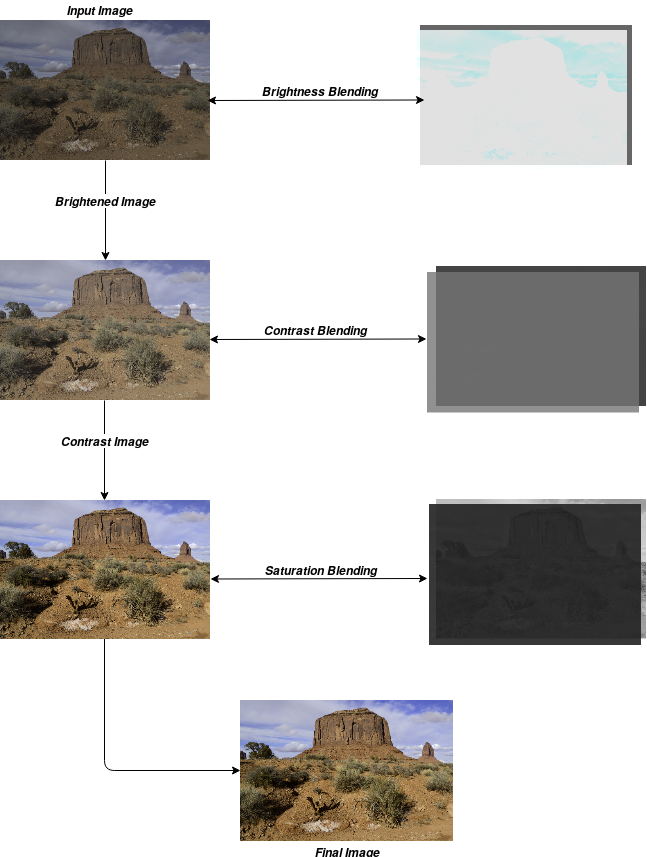
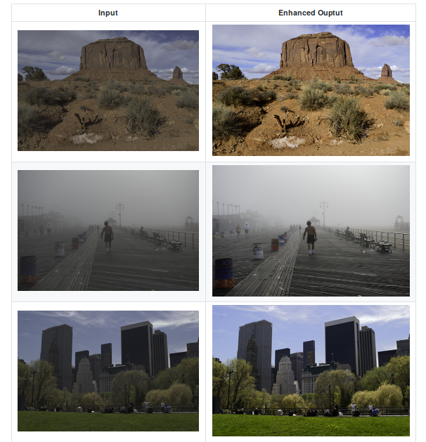

# Aesthetic Enhancment of Images:
Based on HDRnet feature extractor proposed by Google, this method extends the network to produce blending weights for images. The blending weights aim to increase aspects like color saturation, image contrast and image brightness for a given underexposed/flat image.
The feature extractor is displayed below

## HDRnet

## General Pipeline
The pipeline followed is shown in the figure, each blending map predicted by the network is blended to the corresponding input image. The maps are first multiplied by a baseline image before blending is done. The baseline image depends upon the which attribute is beign enhanced (contrast/saturation/brightness).

## Results

