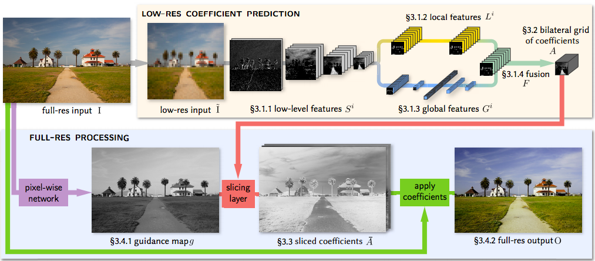

# Aethetic Enhancment of Images:
Based on HDRnet feature extractor proposed by Google, this method extends the network to produce blending weights for images. The blending weights aim to increase aspects like color saturation, image contrast and image brightness for a given underexposed/flat image.
The feature extractor is displayed below

## HDRnet

## Results
#### Before             |  After
:-----------------:|:-----------------:
 | 
 | 
 | 
