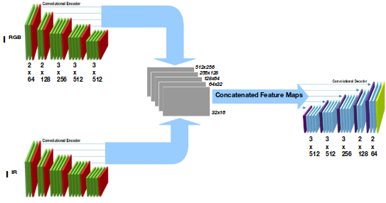

# Mars Rover Manipal

Supervised Depth Estimation using IR images 

Detailed report with metrics [here](https://drive.google.com/open?id=1_dA0_R-ZEDAT6cjaeVOq6hFsXlnt1svV)

## RGB-IR Encoder Decoder Network

## Results Day

## Results Night

