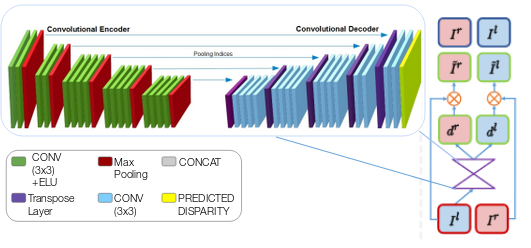

# KAIST Multispectral Depth Estimation:

## IR Monodepth Network

This Repository contains code for Depth Estimation using IR images </br>
It has been tested on GTX 1080ti and tensorflow 1.13 and contains scripts for both inference and training .</br>



Refer (https://github.com/mrharicot/monodepth), for requirements and other details


## Results Day


## Results Night


## Test on Single Image:

Use script monodepth_simple.py  to perform inference. </br>
1. Please copy test image to the IR-Monodepth/demos directory, the resulting output is stored in demos/ </br>
2. Download pretrained model [here](https://drive.google.com/open?id=1NDJJwJY9jddoxOpHEc6qzE3a6XpnAAEc), and place in logs/model/vgg2_kaist </br>

### Sample Command:
```
python monodepth_simple.py --image_path demos/set06_V000_I00019.jpg --checkpoint_path logs/model/vgg2_kaist/model-100000

Please note that there is NO extension after the checkpoint name
```

## Training Instructions:

### Script monodepth_main.py trains IR Monodepth model. </br>

#### Description of inputs to the script: 

1. If existing checkpoint is found, training resumes from there. Else training starts from scratch. </br>

### Sample Command:
```
python monodepth_main.py --mode train --model_name model/model_name --data_path path_to/Reasonable_train_depth/ --filenames_file path_to/kaist_train_files.txt --log_directory logs/

```

## Testing Instructions:

### Script  monodepth_main.py tests IR Monodepth model. </br>

#### Description of pre-requisites to script

1. Download pretrained model [here](https://drive.google.com/open?id=1NDJJwJY9jddoxOpHEc6qzE3a6XpnAAEc), and place in logs/model/vgg2_kaist  </br>

### Sample Command:
```
python monodepth_main.py --mode test --data_path Reasonable_test_depth/ --filenames_file Reasonable_test_depth/kaist_proxytest_files_v2.txt --log_directory logs/ --checkpoint_path logs/model/model_name/model-xxxxx

Please note that there is NO extension after the checkpoint name
This will generate .npy file in utils/disparities
```

## Evaluation Instructions:

### Script eval_kaist.py evals the metrics of IR Monodepth model. </br>

### Sample Command:
```
python eval_kaist.py --npy disparities/PATH_TO_SAVED.npy

Please note this script will display images with highest and lowest absolute error, and also the metrics.
```


